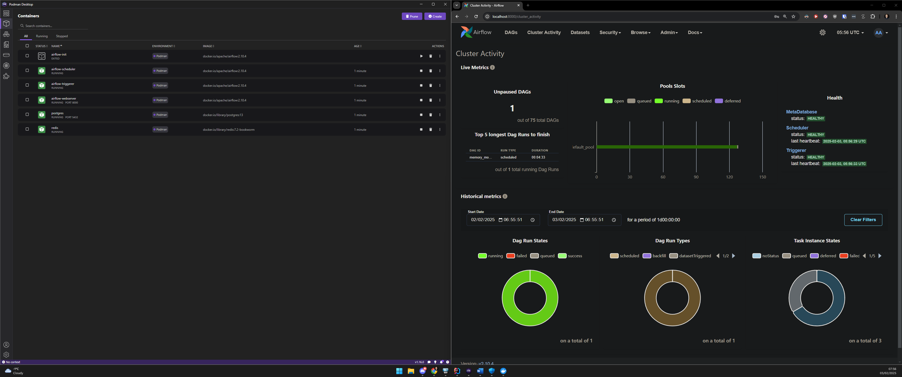

## Eelsõna

Kuna lahendus peab olema käivitatav Windowsi operatsioonisüsteemil, siis proovisin kasutada mitte-igapäevast arvutit.

### Paigaldatud eeldused
1. **Terraform**
2. **Lisasin PATHi terraformi**
3. **Podman Desktop**
4. **Ansible**
    - Kasutasin Cygwin'i; alternatiiv oleks WSL.
    - Podman Desktopi installimise käigus sain aru, et ümber selle ei saa.
    - Ansiblet ei ole "host" masinal vaja.

### Probleemkohad / tähelepanekud
1. **Terraform apply** ei suuda normaalselt hävitada Podmani konteinereid. Proovisin erinevaid workaround’e, nagu force, remove volumes jms.
2. **Ansible jooksutamine** ei läinud korralikult tööle. Minu lahendus oli, et Terraform loob konteineri, mille sees Ansible töötab, aga mingi nõks jäi puudu:
    - **Viga**: Error: Unable to read Docker image into resource: unable to list Docker images: Get "http://%2F%2F.%2F%2Fpipe%2F%2Fpodman-machine-default/v1.41/images/json": context deadline exceeded.
3. **Windows PowerShell**-is on väga harjumatu käske jooksutada.
4. **Podman** tundub päris kiire. (Olen varem kasutanud Kind, Docker, Kubernetes).

### TODO
- Asendada konteinerite haldamine Ansible'iga.
- Saata tegelik testimine e-posti kaudu.
- Selgitada välja, kas Redis on vajalik.
- Uurida kas mingi UI graafik / Ram joon on ka võimalik
